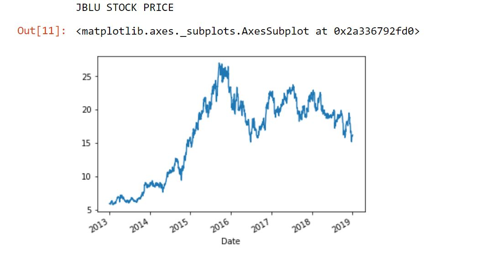

# Customer Sentiment Analyzer

## ✈️ Description

Data collected from public domains and social media to achieve an average customer sentiment score displayed in a graph. <br />
Uses dates, sentiment score and magnitude as data.

## Requirements

python3 <br />
matplotlib - [Installation](https://matplotlib.org/users/installing.html) <br />
QtPy5 - [Installation](https://pypi.org/project/PyQt5/)

## Installing

```bash
git clone https://github.com/dannyhollman/yhack2019.git
```

## Usage

Run the main file for GUI
```
python3 customer_sentiment_analyzer.py
```

## Data

* twitter - tweets related to jetBlue from 2019 to 2013
* yelp - jetBlue, American, Delta and Spirit reviews collected
```
date, sentiment
```

## Example Graphs




## File Structure
0. [customer_sentiment_analyzer.py](customer_sentiment_analyzer.py) - Main function
* ``def graph_jetblue():`` - graph for jetblue analytics.
* ``def graph_american():`` - graph for american analytics.
* ``def graph_spirit():`` - graph for spirit analytics.
* ``def graph_delta():`` - graph for delta analytics.

1. [american_yelp_sent.json](american_yelp_sent.json) - list of key, values for american.

2. [delta_yelp_sent.json](delta_yelp_sent.json) - list of key, values for delta.

3. [more_twitter_data.json](more_twitter_data.json) - list of key, values for jetblue.

4. [spirit_yelp_sent.json](spirit_yelp_sent.json) - list of key, values for spirit.

4. [dev](dev) - developer files.
* ``adaptive.json``
* ``american_yelp.json``
* ``delta_yelp.json``
* ``jetblue.json``
* ``jetblue_tripadvisor_sent.json``
* ``jetblue_twitter_sent.json``
* ``jetblue_yelp.json``
* ``jetblue_yelp_sent.json``
* ``main.py``
* ``parse_json_data.py``
* ``sentiment.py``
* ``spirit_yelp.json``
* ``trip_adv_data.py``
* ``trip_advisor_to_file.py``
* ``yelp_data.py``
* ``yelp_reviews.csv``
* ``yelp_scrape_to_csv.py``

## Authors

* Danny Hollman
* William Dyrland-Marquis
* Jose Alvarez de Lugo
* Stephen Ranciato
